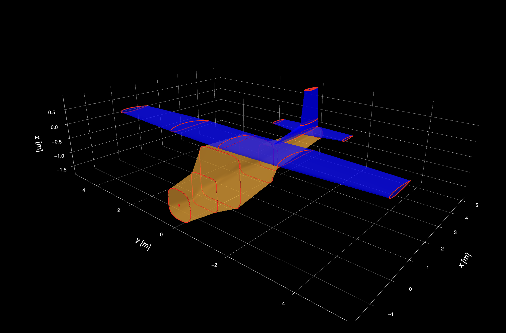

# AeroGeometry.jl

[](https://antoniosgeme.com/AeroGeometry.jl/dev)
[](https://github.com/antoniosgeme/AeroGeometry.jl/actions/workflows/Test.yml?query=branch%3Amain)
[](https://codecov.io/gh/antoniosgeme/AeroGeometry.jl)
[](https://github.com/antoniosgeme/AeroGeometry.jl/actions/workflows/Docs.yml?query=branch%3Amain)
[](https://github.com/JuliaBesties/BestieTemplate.jl)

<p align="center">
  
</p>

A Julia library for creating and manipulating aircraft geometry.

## Installation

```julia
using Pkg
Pkg.add("https://github.com/antoniosgeme/AeroGeometry.jl.git")
```

## Quick Examples

### Airfoil Operations

```julia
using AeroGeometry
import Plots as plt

# Load airfoils from database
airfoil1 = Airfoil("naca2412")
airfoil2 = Airfoil("e221")

# Blend airfoils
blended = blend_airfoils(airfoil1, airfoil2, fraction=0.5)

# Plot with camber line
plt.plot(blended)
camb = camber(blended)
plt.plot!(camb[:,1], camb[:,2], lw=2)
```

### Wing Definition

```julia
using AeroGeometry: ft2m

wing = Wing(
    name="Main Wing",
    sections=[
        WingSection(
            airfoil=Airfoil("naca2412"),
            position=[0, 0, 0],
            chord=ft2m(5, 4)
        ),
        WingSection(
            airfoil=Airfoil("naca0012"),
            position=[1.2, 5.0, 0.15],  # x, y, z in meters
            chord=1.1,
            twist=-2.0  # degrees
        )
    ],
    symmetric=true
)

plt.plot(wing)
```

### Complete Aircraft

```julia
# Load pre-defined aircraft
cessna = cessna152()
plt.plot(cessna)

# Or build your own
airplane = Airplane(
    name="Custom Aircraft",
    wings=[main_wing, h_stab, v_stab],
    fuselages=[fuselage]
)
```


